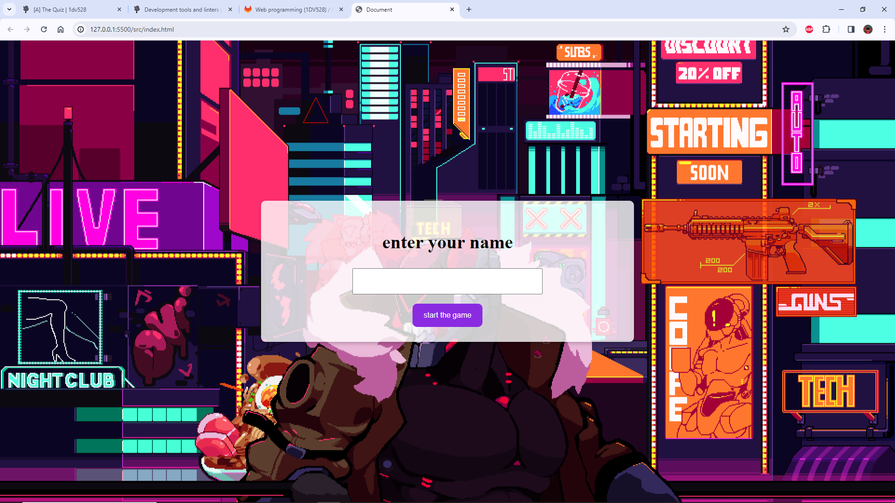

# A2 – Quiz App (1DV528)



## solution

I divided the code into classes, and each class is responsible for specific things. For example, the 'Player' class is responsible for handling the player only, and 'HtmlController' is responsible for controlling the HTML elements according to the needs of the quiz. The 'Quiz' class is the main class for the quiz, css file is used to style the website.


It is the first time for me using JavaScript, and it was a very interesting introduction to JavaScript.

## Installing 

Certainly, here's a rewritten version as points:

1. Begin by cloning the repository onto your computer.
2. Launch the terminal and use the "cd" command to enter the repository's directory.
3. In the project's main directory, run "npm install" to retrieve all required project dependencies.
4. Initiate the application build with "npm run build" for compiling necessary assets using Vite.
5. Proceed to launch the application by typing "npm run serve" in the terminal.
6. Navigate to "http://localhost:4173/" in your web browser to view the quiz.
7. Get started with the quiz and enjoy exploring the application! Follow these steps for a smooth setup of my code.


## Rulels 

After navigating to the web server, you need to enter your name or nickname and then click 'Enter' or click on the 'Start the Game' button. Then, you need to answer the questions within the time frame shown by the timer. You can press 'Enter' or click on the button to submit your answers. Some questions have alternatives from which you need to choose the correct one. In case of winning or losing, you have two options: viewing the top 5 scores or restarting the game. If you choose to restart the game, you will need to enter your name again.


## linters 

1. Utilize various linters during the development process to ensure code quality.
2. Run "npm run stylelint" to identify and report any style sheet issues. Execute "npm run stylelint:fix" to attempt automatic corrections.
3. Employ "npm run htmlhint" to scan and report any issues within HTML files.
4. Utilize "npm run eslint" for analyzing and reporting on JavaScript file inconsistencies. Use "npm run eslint:fix" for automatic problem resolution attempts.
5. Execute "npm run lint" to concurrently run all available linters for comprehensive code checks.
6. Generate code documentation by executing "npm run jsdoc", which organizes and provides details about your code's structure and components.


##  Features
- Multiple-choice questions (single answer)
- Progress, score, and per-question feedback
- Optional timer per quiz (configurable)
- **State persistence** via `localStorage` (resume where you left off)
- **Keyboard navigation** and basic ARIA roles/labels
- Responsive layout (mobile → desktop)

##  Project Structure
```
a2-quiz/
├─ index.html
├─ css/
│  └─ styles.css
├─ js/
│  ├─ app.js          # main app logic (state, routing, events)
│  ├─ render.js       # DOM rendering helpers
│  ├─ storage.js      # localStorage helpers
│  └─ data.js         # fallback questions (if not using JSON)
├─ data/
│  └─ questions.json  # quiz questions (if using external JSON)
└─ README.md
```

##  Getting Started

### 1) Clone
```bash
git clone https://github.com/mustafaqh/Web-programming-1DV528-Client-side-.git
cd Web-programming-1DV528-Client-side-/a2-quiz
```

### 2) Run locally
Open `index.html` directly, **or** serve with a tiny static server (recommended for `fetch`/JSON):

```bash
# Python 3 (macOS/Linux)
python3 -m http.server 5173

# Node (if installed)
npx http-server -p 5173
```
Then visit: `http://localhost:5173`

### 3) Configure questions
If you use `data/questions.json`, the schema can look like:
```json
[
  {
    "id": 1,
    "question": "Which method adds an item to the end of an array in JS?",
    "options": ["push()", "pop()", "shift()", "unshift()"],
    "answerIndex": 0,
    "explanation": "`push()` appends one or more elements to the end of an array."
  }
]
```

If you embed questions in `js/data.js`, export an array with the same shape.

##  How It Works
- **State**: current question index, answers, score, timer ⇒ kept in memory and mirrored to `localStorage` (e.g., key `quiz-state-v1`).
- **Flow**: Start → render question → select answer → submit → feedback → next → results.
- **Rendering**: `render.js` updates DOM nodes; event handlers live in `app.js`.
- **Data**: Loaded from `data/questions.json` via `fetch`, with `js/data.js` as a fallback if `fetch` fails.

##  Accessibility Notes
- Each question uses a `<fieldset>`/`<legend>` or an ARIA-labeled group.
- Radio inputs are focusable in logical order; pressing **Enter/Space** selects.
- Buttons have visible focus styles; live regions announce feedback (e.g., `aria-live="polite"`).
- Color contrast ≥ 4.5:1 (check your CSS).

##  Manual Test Checklist
- Start, answer all questions, see score & feedback
- Refresh mid-quiz → state persists
- Keyboard-only: Tab/Shift+Tab through controls, Space/Enter to activate
- Mobile layout (≤ 375px) is usable without horizontal scroll
- Timer (if enabled) counts down and ends quiz correctly

##  Build/Dependencies
No build step; no external dependencies required. Pure client-side.

##  Deploy (GitHub Pages)
1. In the repo, go to **Settings → Pages**.
2. Source: **Deploy from a branch** → `main` → `/root` (or the repo root).
3. If you want to publish only `a2-quiz/`, move it to its own repo or use a Pages workflow pointing to that subfolder.
4. After deploy, the app is available at your Pages URL.

## 🧭 Scripts (optional)
Add these to a root-level `package.json` if you prefer Node tooling:
```json
{
  "scripts": {
    "serve": "http-server -p 5173 a2-quiz",
    "lint": "eslint a2-quiz/js --ext .js"
  }
}
```

## 🗺️ Roadmap / TODO
- Add question categories & difficulty filters
- Add review mode (see all questions & explanations)
- Add progress save/export (download JSON)
- Basic unit tests for scoring & storage helpers

## 📄 License
MIT — free to use for learning and showcases.
